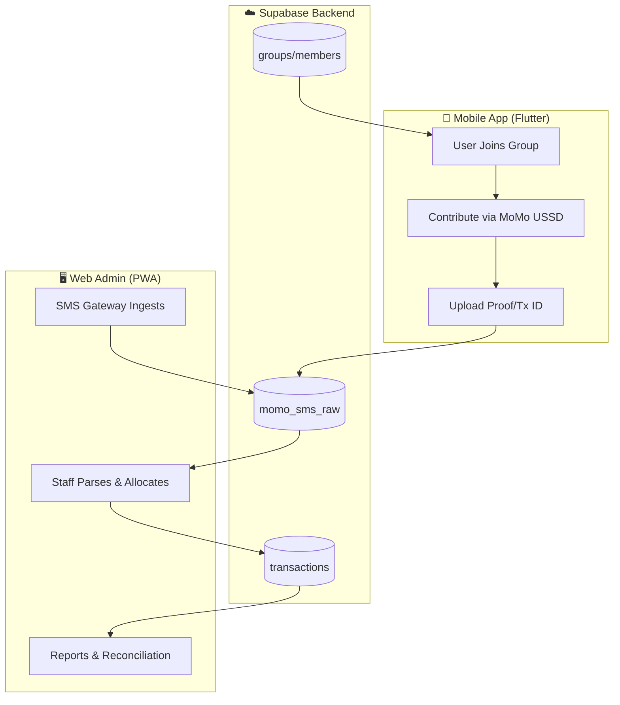
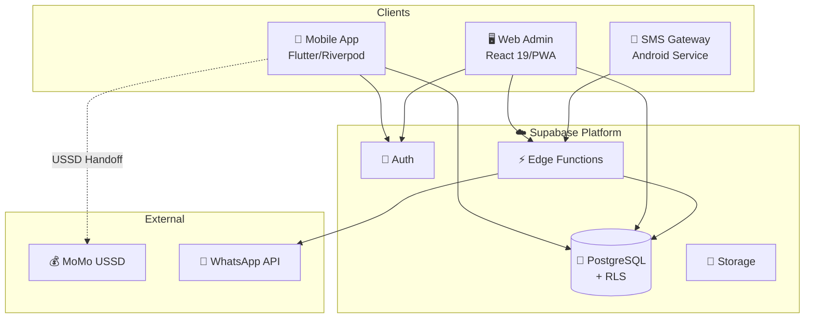
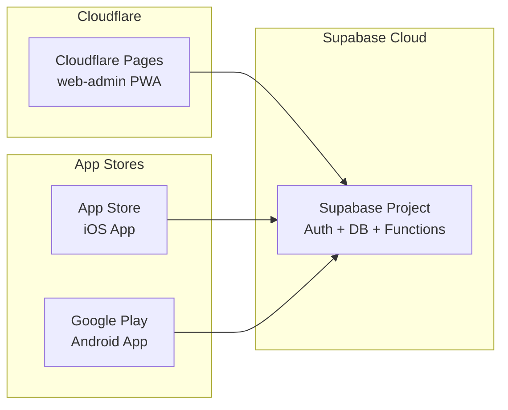

# Ibimina Monorepo

<div align="center">


**Rwanda-first digital savings platform with group micro-savings, MoMo USSD payments, and transparent ledger reconciliation.**

[Quick Start](#-quick-start) • [Architecture](#-architecture) • [Applications](#-applications) • [Deployment](#-deployment) • [API Reference](#edge-functions)

</div>

---

## 📋 Overview

**Ibimina** digitizes the traditional Rwandan "Kimina" group savings experience. The platform consists of **two distinct applications** sharing a common Supabase backend:

| Application | Type | Purpose |
|-------------|------|---------|
| **Mobile App** | Flutter (iOS/Android) | Consumer-facing app for group members to contribute, view wallets, and track savings |
| **Web Admin** | React PWA | Staff/Admin portal for SMS reconciliation, group management, and reporting |

### Core Workflow



---

## 🗂️ Repository Structure

```
ibimina_gemini/
├── apps/
│   ├── mobile-app/          # 📱 Flutter client (iOS/Android)
│   ├── web-admin/           # 🖥️ React PWA (Staff/Admin Portal)
│   └── sms-gateway/         # 📡 SMS ingestion service (Flutter)
├── supabase/
│   ├── functions/           # ⚡ 14 Deno Edge Functions
│   ├── migrations/          # 🗄️ 91+ PostgreSQL migrations
│   ├── seed/                # 🌱 Development seed data
│   └── schema.sql           # 📋 Complete schema reference
├── docs/                    # 📖 Documentation
├── package.json             # 🔧 Monorepo root
└── README.md                # 📘 This file
```

---

## 🏗️ Architecture

### System Overview



### Security Model

| Layer | Mechanism |
|-------|-----------|
| **Authentication** | Supabase Auth (SMS OTP + Google OAuth) |
| **Authorization** | Row Level Security (RLS) + `institution_id` scoping |
| **API Protection** | Edge Function auth checks + rate limiting |
| **Data Integrity** | Immutable transactions, append-only ledger |

---

## 📱 Applications

### 1. Mobile App (Flutter Client)

**Location:** `apps/mobile-app/`

The consumer-facing mobile application for group members to participate in micro-savings groups.

<details>
<summary><strong>📊 Tech Stack</strong></summary>

| Layer | Technology |
|-------|------------|
| **Framework** | Flutter 3.10+ (Dart 3.10) |
| **State Management** | Riverpod 3.2 |
| **Backend** | Supabase Flutter SDK 2.12 |
| **Navigation** | GoRouter 17.0 |
| **Auth** | SMS OTP + Google Sign-In |
| **Security** | Flutter Secure Storage + Local Auth (Biometric) |
| **Monitoring** | Sentry Flutter 9.10 |

</details>

<details>
<summary><strong>📁 Feature Modules</strong></summary>

```
lib/
├── core/               # Infrastructure (config, types, errors)
├── features/
│   ├── auth/           # Login, registration, profile completion
│   ├── groups/         # Group discovery, joining, management
│   ├── contribution/   # MoMo USSD handoff, proof upload
│   ├── ledger/         # Transaction history, wallet view
│   ├── dashboard/      # Home screen, KPIs
│   ├── invites/        # QR codes, deep links
│   ├── rewards/        # Gamification, badges
│   ├── settings/       # Profile, preferences
│   ├── support/        # FAQ, help
│   └── momo/           # MoMo integration utilities
├── shared/             # Reusable components
└── ui/                 # Design system tokens
```

</details>

<details>
<summary><strong>👥 Mobile App Roles</strong></summary>

| Role | Capabilities |
|------|--------------|
| **Member** | Join group, Contribute (USSD), View Wallet, Fix Rejections |
| **Chair** | View Member List, Invite Users, Manage Group |
| **Treasurer** | Approve/Reject Pending Contributions |

</details>

<details>
<summary><strong>🚀 Getting Started (Mobile)</strong></summary>

```bash
# Navigate to mobile app
cd apps/mobile-app

# Install dependencies
flutter pub get

# Run code generation (if needed)
dart run build_runner build --delete-conflicting-outputs

# Run on device/emulator
flutter run
```

</details>

---

### 2. Web Admin (Staff/Admin Portal PWA)

**Location:** `apps/web-admin/`

A Progressive Web App for staff and administrators to manage SMS reconciliation, groups, members, and generate reports.

<details>
<summary><strong>📊 Tech Stack</strong></summary>

| Layer | Technology |
|-------|------------|
| **Frontend** | React 19, TypeScript 5.8, Vite 6 |
| **Styling** | TailwindCSS 3 + Framer Motion 12 |
| **State** | TanStack Query 5 (React Query) |
| **Backend** | Supabase JS SDK 2.49 |
| **PWA** | vite-plugin-pwa (Service Worker, offline) |
| **Hosting** | Cloudflare Pages |
| **Testing** | Vitest (unit), Playwright (E2E) |
| **Monitoring** | Sentry |

</details>

<details>
<summary><strong>📁 Source Structure</strong></summary>

```
src/
├── core/               # Infrastructure (config, types, errors)
├── features/
│   ├── auth/           # Authentication
│   ├── dashboard/      # Dashboard & KPIs
│   ├── directory/      # Groups & Members management
│   ├── transactions/   # SMS reconciliation & allocation
│   ├── reports/        # Report generation & export
│   └── settings/       # Institution settings, staff mgmt
├── shared/             # Reusable UI components
├── hooks/              # Global hooks
├── lib/                # Utilities & API clients
└── components/         # Base UI components
```

</details>

<details>
<summary><strong>👥 Web Admin Roles</strong></summary>

| Role | Access Level |
|------|--------------|
| **ADMIN** | Full platform access: manage staff, institutions, settings, all directory operations, approve public groups |
| **STAFF** | Daily operations: view dashboard, manage groups/members, transactions, reports |

</details>

<details>
<summary><strong>🚀 Getting Started (Web Admin)</strong></summary>

```bash
# Navigate to web admin
cd apps/web-admin

# Install dependencies
npm install

# Configure environment
cp .env.example .env.local
# Edit .env.local with Supabase credentials

# Start development server
npm run dev
# → http://localhost:5173
```

</details>

---

### 3. SMS Gateway

**Location:** `apps/sms-gateway/`

A Flutter-based Android service that captures incoming MoMo SMS and forwards them to the Supabase backend.

```bash
# Navigate to SMS gateway
cd apps/sms-gateway
flutter pub get
flutter run
```

---

## ⚡ Edge Functions

| Function | Purpose |
|----------|---------|
| `sms-ingest` | Secure SMS ingestion endpoint (from gateway) |
| `parse-momo-sms` | Parse pending SMS (deterministic + AI fallback) |
| `health` | System health check |
| `staff-invite` | Staff invitation handler |
| `whatsapp-webhook` | WhatsApp webhook receiver |
| `send-whatsapp` | Send WhatsApp messages |
| `ibimina-confirm-contribution` | Member contribution confirmations |
| `ibimina-join-group` | Group join request handler |
| `bulk-import-groups` | Bulk group import |
| `bulk-import-members` | Bulk member import |
| `generate-group-report` | Generate group reports |
| `ocr-extract` | OCR text extraction from proof images |
| `set-whatsapp-secrets` | Configure WhatsApp secrets |

---

## 🗄️ Database

### Key Tables

| Table | Purpose |
|-------|---------|
| `institutions` | Multi-tenant institutions (SACCOs, savings groups) |
| `profiles` | User profiles with role + institution |
| `groups` | Savings groups (public/private) |
| `members` | Group members with roles (chair/treasurer/member) |
| `momo_sms_raw` | Raw SMS storage (idempotent ingestion) |
| `transactions` | Parsed transactions (immutable ledger) |
| `contributions` | Member contribution records |
| `audit_log` | All important actions logged |

### Security Model

- **RLS Enabled** on all sensitive tables
- **Tenant Isolation** via `institution_id` scoping
- **Helper Functions**: `current_institution_id()`, `is_platform_admin()`
- **Immutability**: Transaction facts cannot be modified

---

## 🛠️ Development Commands

### Root (Monorepo)

| Command | Purpose |
|---------|---------|
| `npm run dev:web` | Start web-admin dev server |
| `npm run build:web` | Build web-admin for production |
| `npm run test` | Run tests across all workspaces |

### Web Admin (`apps/web-admin/`)

| Command | Purpose |
|---------|---------|
| `npm run dev` | Development server (localhost:5173) |
| `npm run build` | Production build |
| `npm run typecheck` | TypeScript type checking |
| `npm run lint` | ESLint |
| `npm run test` | Unit tests (Vitest) |
| `npm run e2e` | E2E tests (Playwright) |
| `npm run storybook` | Component storybook |
| `npm run deploy:preview` | Deploy to Cloudflare preview |
| `npm run deploy:production` | Deploy to Cloudflare production |

### Mobile App (`apps/mobile-app/`)

| Command | Purpose |
|---------|---------|
| `flutter pub get` | Install dependencies |
| `flutter run` | Run on connected device/emulator |
| `flutter build apk` | Build Android APK |
| `flutter build ios` | Build iOS app |
| `flutter test` | Run tests |
| `dart run build_runner build` | Generate code (freezed, riverpod) |

### Supabase

| Command | Purpose |
|---------|---------|
| `supabase start` | Start local Supabase |
| `supabase db push` | Apply migrations to remote |
| `supabase functions deploy` | Deploy Edge Functions |
| `supabase gen types typescript` | Generate TypeScript types |

---

## 🚢 Deployment

### Architecture



### Environments

| Environment | Web Admin | Mobile | Backend |
|-------------|-----------|--------|---------|
| **Local** | `npm run dev` | `flutter run` | `supabase start` |
| **Preview** | Cloudflare preview URL | Internal builds | Staging project |
| **Production** | `sacco.pages.dev` | App stores | Production project |

---

## 📖 Documentation

| Document | Purpose |
|----------|---------|
| [SCHEMA.md](docs/SCHEMA.md) | Database schema reference |
| [API_CONTRACT.md](docs/API_CONTRACT.md) | API contracts and types |
| [QA_SMOKE_TEST.md](docs/QA_SMOKE_TEST.md) | QA smoke test checklist |
| [RELEASE_CHECKLIST.md](docs/RELEASE_CHECKLIST.md) | Release checklist |
| [SECURITY_PRIVACY_REVIEW.md](docs/SECURITY_PRIVACY_REVIEW.md) | Security & privacy review |
| [SECURITY_REDTEAM_CHECKLIST.md](docs/SECURITY_REDTEAM_CHECKLIST.md) | Red team security checklist |
| [BUILD_COMMANDS.md](docs/BUILD_COMMANDS.md) | Build commands reference |
| [DEPENDENCY_POLICY.md](docs/DEPENDENCY_POLICY.md) | Dependency management policy |

---

## 🔒 Security

### Non-Negotiables

1. **RLS on all tables** — Database enforces tenant isolation
2. **Immutable transactions** — Ledger facts cannot be modified
3. **USSD-only payments** — No in-app payment APIs, MoMo handoff only
4. **Audit logging** — All important actions logged
5. **No secrets in client** — Only anon key exposed

### Constraints

| Constraint | Value |
|------------|-------|
| Max contribution per transaction | 4,000 RWF |
| Max wallet balance | 500,000 RWF |
| Users per group | 1 (strict enforcement) |

---

## 🤝 Contributing

### Guiding Principles

1. **Minimal UI, strong correctness** — Simplicity over features
2. **DB constraints + RLS over frontend trust** — Security at data layer
3. **No in-app payments** — USSD-only, never add payment gateways
4. **Transactions are immutable** — Parse once, allocate many
5. **Audit everything** — Every important action logged

### Workflow

1. Create feature branch from `main`
2. Implement following existing patterns
3. Add/update tests
4. Run `npm run typecheck` (web) or `flutter analyze` (mobile)
5. Run E2E smoke tests
6. Create PR for review

---

## 📄 License

TBD

---

## 🆘 Support

For issues or questions, please open a GitHub issue.
