# Ibimina (SACCO+) — MoMo SMS Ledger & Reconciliation PWA

<div align="center">


**A minimalist, operations-first PWA for SACCOs and group savings.**

[Quick Start](#quick-start) • [Architecture](#architecture) • [Features](#features) • [Deployment](#deployment) • [API Reference](#api-reference)

</div>

---

## 📋 Overview

Ibimina ingests **Mobile Money (MoMo) SMS**, parses them into **immutable transactions**, and provides a clean workflow for staff to **allocate** transactions to **members and groups**, then generate **institution/group/member reports**.

### Core Workflow

```mermaid
flowchart LR
    A[📱 MoMo SMS] --> B[🔐 Ingest API]
    B --> C[(momo_sms_raw)]
    C --> D[⚙️ Parser]
    D --> E[(transactions)]
    E --> F[👤 Staff Allocates]
    F --> G[📊 Reports]
```



| Step | Description |
|------|-------------|
| **1. SMS Ingest** | MoMo SMS arrives from Android gateway/webhook |
| **2. Raw Storage** | Stored in `momo_sms_raw` with strict dedupe |
| **3. Parsing** | Deterministic extraction (AI fallback optional) |
| **4. Transactions** | Immutable rows in `transactions` table |
| **5. Reconciliation** | Staff allocates transactions to members |
| **6. Reports** | Institution/group/member statements + CSV |

---

## 🚀 Quick Start

### Prerequisites

- **Node.js** ≥20.19.0 (see `.nvmrc`)
- **npm** or **pnpm**
- **Supabase CLI** (for local development)

### Installation

```bash
# Clone and install
git clone <repo-url>
cd ibimina_gemini
npm install

# Configure environment
cp .env.example .env.local
# Edit .env.local with your Supabase credentials
```

### Environment Variables

```bash
# Required (from Supabase Dashboard → Settings → API)
VITE_SUPABASE_URL=https://your-project.supabase.co
VITE_SUPABASE_ANON_KEY=eyJhbG...

# Optional
VITE_SENTRY_DSN=https://...@sentry.io/...
```

> ⚠️ **Never use the service role key in frontend.** Only the `anon` key is safe to expose.

### Running Locally

```bash
# Start development server
npm run dev
# → http://localhost:3000

# Type check
npm run typecheck

# Run tests
npm run test

# Build for production
npm run build
```

### Verify Configuration

```bash
node scripts/verify-supabase-config.js
```

---

## 🏗️ Architecture

### Tech Stack

| Layer | Technology |
|-------|------------|
| **Frontend** | React 19, TypeScript 5.8, Vite 6 |
| **Styling** | TailwindCSS 3, Framer Motion 12 |
| **State** | TanStack Query 5 (React Query) |
| **Backend** | Supabase (PostgreSQL + Auth + Edge Functions) |
| **Hosting** | Cloudflare Pages |
| **PWA** | vite-plugin-pwa (Service Worker, offline) |
| **Testing** | Vitest (unit), Playwright (E2E) |
| **Monitoring** | Sentry |

### Project Structure

```
├── src/
│   ├── core/                 # Infrastructure (config, types, errors)
│   ├── features/             # Feature modules (vertical slices)
│   │   ├── auth/             # Authentication
│   │   ├── dashboard/        # Dashboard & KPIs
│   │   ├── directory/        # Groups & Members
│   │   ├── reports/          # Report generation
│   │   ├── settings/         # Institution settings
│   │   └── transactions/     # Transaction management
│   ├── shared/               # Reusable UI components
│   ├── hooks/                # Global hooks
│   ├── lib/                  # Utilities & API clients
│   └── App.tsx               # Main entry
├── supabase/
│   ├── migrations/           # 69 SQL migrations
│   ├── functions/            # 15 Edge Functions
│   └── seed/                 # Development seed data
├── e2e/                      # Playwright E2E tests
├── docs/                     # Comprehensive documentation
└── public/                   # Static assets & PWA manifest
```

### Feature-Based Architecture

Each feature is a **vertical slice** with its own components, hooks, and services:

```typescript
// Import from feature modules
import { useTransactionsV2 } from '@/features/transactions';
import { useMembersV2 } from '@/features/directory';
import { Button } from '@/shared/components/ui';
```

---

## 👥 Roles & Access

| Role | Access Level |
|------|--------------|
| **PLATFORM_ADMIN** | Full access across all institutions |
| **INSTITUTION_ADMIN** | Manages staff + directory for their institution |
| **INSTITUTION_STAFF** | Daily operations (transactions, allocation) |
| **INSTITUTION_AUDITOR** | Read-only (ledger + reports + audit log) |

> Every staff user belongs to exactly **one institution**, except Platform Admins.

### RBAC Enforcement

- **UI Layer**: Route guards, conditional rendering
- **API Layer**: Edge Function auth checks
- **Database Layer**: PostgreSQL RLS policies

---

## 📦 Features

### Dashboard
- Today's KPIs + weekly trends
- Quick actions (New Group, Add Member, Record Deposit)
- Needs attention items (unallocated transactions, parse errors)

### Transactions
- Unified ledger view with filtering
- Status: All | Unallocated | Allocated | Flagged
- Transaction detail drawer with allocation action
- Infinite scroll + CSV export

### Directory
- Groups (wizard + CSV import)
- Members (wizard + CSV import)
- WhatsApp notifications for group leaders

### Reports
- Institution / Group / Member scopes
- Breakdown + ledger views
- CSV export

### Settings
- Institution profile & MoMo codes
- Parsing thresholds & dedupe rules
- SMS sources/devices (health monitoring)
- Staff management
- Audit log

---

## 🔧 Edge Functions

| Function | Purpose |
|----------|---------|
| `sms-ingest` | Secure SMS ingestion endpoint |
| `parse-momo-sms` | Parse pending SMS (deterministic + AI fallback) |
| `health` | System health check |
| `staff-invite` | Staff invitation handler |
| `whatsapp-webhook` | WhatsApp webhook receiver |
| `send-whatsapp` | Send WhatsApp messages |
| `send-contribution-confirmation` | Member contribution confirmations |
| `process-pending-notifications` | Notification queue processor |
| `send-scheduled-notifications` | Scheduled notifications |
| `bulk-import-groups` | Bulk group import |
| `bulk-import-members` | Bulk member import |
| `generate-group-report` | Generate group reports |
| `ocr-extract` | OCR text extraction |
| `set-whatsapp-secrets` | Configure WhatsApp secrets |

---

## 🗄️ Database

### Key Tables

| Table | Purpose |
|-------|---------|
| `institutions` | Multi-tenant institutions |
| `profiles` | User profiles with role + institution |
| `groups` | Savings groups |
| `members` | Group members |
| `momo_sms_raw` | Raw SMS storage (idempotent) |
| `transactions` | Parsed transactions (immutable) |
| `audit_log` | All important actions |

### Security Model

- **RLS Enabled**: All sensitive tables
- **Tenant Isolation**: `institution_id` scoping
- **Helper Functions**: `current_institution_id()`, `is_platform_admin()`
- **Immutability**: Transaction facts cannot be modified

---

## 🧪 Testing

### Unit Tests (Vitest)

```bash
npm run test              # Run tests
npm run test:coverage     # With coverage report
```

### E2E Tests (Playwright)

```bash
npm run e2e              # All E2E tests
npm run e2e:smoke        # Smoke tests
npm run e2e:critical     # Critical flows
npm run e2e:ui           # Interactive mode
```

### Critical Flows Tested

- Login → Dashboard loads
- Transactions filter + allocation
- Parse error resolution
- Create group/member wizard
- Reports export
- RBAC enforcement

---

## 🚢 Deployment

### Cloudflare Pages

```bash
# Preview deployment
npm run deploy:preview

# Production deployment
npm run deploy:production
```

### Supabase

```bash
# Deploy Edge Functions
supabase functions deploy

# Apply migrations
supabase db push
```

### Environment Configuration

| Environment | Configuration |
|-------------|---------------|
| **Local** | `.env.local` (git-ignored) |
| **Preview** | Cloudflare Dashboard → Environment Variables |
| **Production** | Cloudflare Dashboard → Environment Variables |

---

## 📖 Documentation

| Document | Purpose |
|----------|---------|
| [ARCHITECTURE.md](docs/ARCHITECTURE.md) | System architecture |
| [AUDIT_REPORT.md](docs/AUDIT_REPORT.md) | Production readiness audit |
| [IMPLEMENTATION_PLAN.md](docs/IMPLEMENTATION_PLAN.md) | Implementation roadmap |
| [DEPLOYMENT.md](docs/DEPLOYMENT.md) | Deployment instructions |
| [RELEASE_RUNBOOK.md](docs/RELEASE_RUNBOOK.md) | Production deployment runbook |
| [SECURITY_AUDIT.md](docs/SECURITY_AUDIT.md) | Security findings |
| [API_REFERENCE.md](docs/API_REFERENCE.md) | API documentation |

---

## 🛠️ Development Commands

| Command | Purpose |
|---------|---------|
| `npm run dev` | Start development server |
| `npm run build` | Production build |
| `npm run preview` | Preview production build |
| `npm run typecheck` | TypeScript type checking |
| `npm run lint` | ESLint |
| `npm run test` | Run unit tests |
| `npm run e2e` | Run E2E tests |
| `npm run storybook` | Component storybook |

---

## 🔒 Security

### Non-Negotiables

1. **RLS on all tables** — Database enforces tenant isolation
2. **Immutable transactions** — Facts cannot be modified
3. **Audit logging** — All important actions logged
4. **SMS authentication** — API key + source validation
5. **No secrets in client** — Only anon key exposed

### Compliance

- Multi-tenant data isolation
- PII encryption support
- Rate limiting
- IP whitelisting (optional)

---

## 📊 Production Readiness

| Gate | Status |
|------|--------|
| TypeScript | ✅ Clean |
| Build | ✅ Passing |
| RLS Policies | ✅ Enabled |
| Audit Logging | ✅ Configured |
| Error Tracking | ✅ Sentry |
| PWA | ✅ v1.2.0 |

See [AUDIT_REPORT.md](docs/AUDIT_REPORT.md) for detailed assessment.

---

## 🤝 Contributing

### Guiding Principles

1. **Minimal UI, strong correctness** — Simplicity over features
2. **DB constraints + RLS over frontend trust** — Security at data layer
3. **No duplicate tables** — Audit existing schema first
4. **Transactions are immutable** — Parse once, allocate many
5. **Audit everything** — Every important action logged

### Workflow

1. Create feature branch from `main`
2. Implement following existing patterns
3. Add/update tests
4. Run `npm run typecheck` and fix errors
5. Run `npm run e2e:smoke` to verify
6. Create PR for review

---

## 📄 License

TBD

---

## 🆘 Support

For issues or questions, please open a GitHub issue.
